# StokYonetimiSistemi
ASP.NET MVC ile geliştirilmiş <i>STOK YÖNETİMİ SİSTEMİ</i>

Uygulamanın arayüz çıktıları:

TODO:
<ul>
    <li>Satış yapma ekranında ürün ve müşteri dropdownlist ile gelsin</li>
    <li>Satışlar sayfasında daha önce yapılmış satışlar listelensin</li>
    <li>Geribildirim ekranında yapılan geribildirimle db'de tutulsun</li>
    <li>Geribildirim ekranında mesaj textbox yüksekliği artırılsın</li>
    <li>Geribildirim butonu navbara göre ayarlansın</li>
</ul>

Kategoriler sayfası:

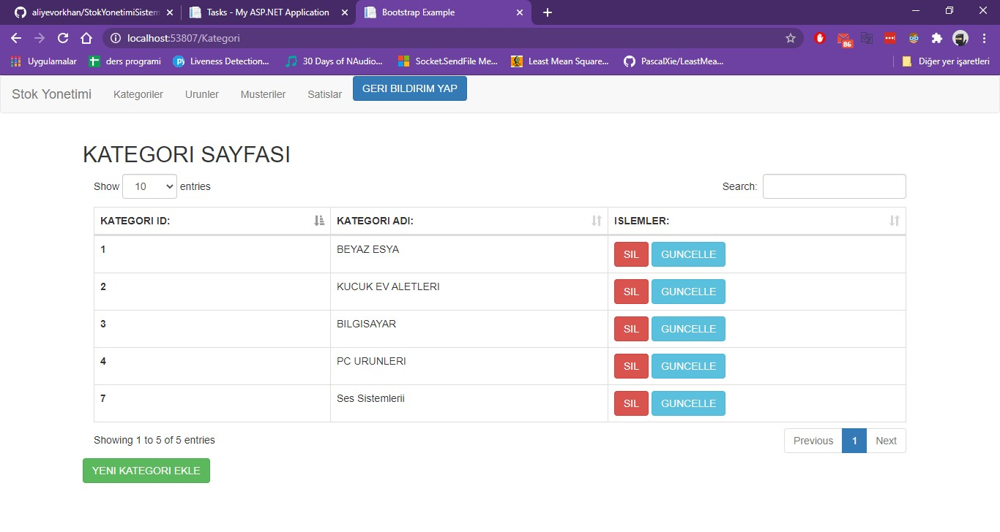

Yeni Kategori Ekleme sayfası:

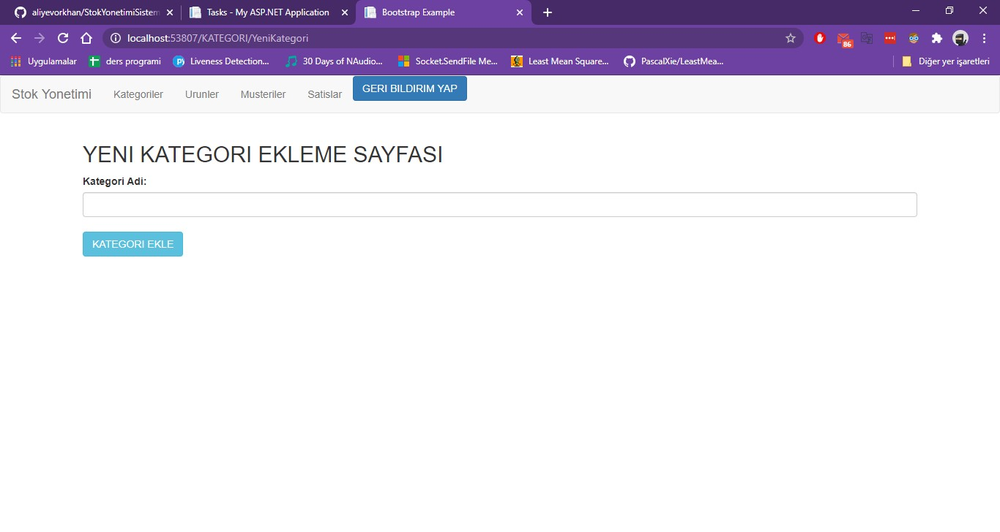

Kategori Güncelleme sayfası:

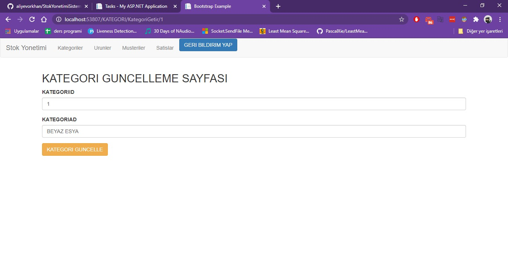

Ürünler sayfası:

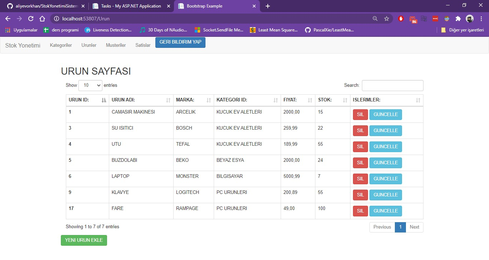

Yeni Ürün Ekleme sayfası:

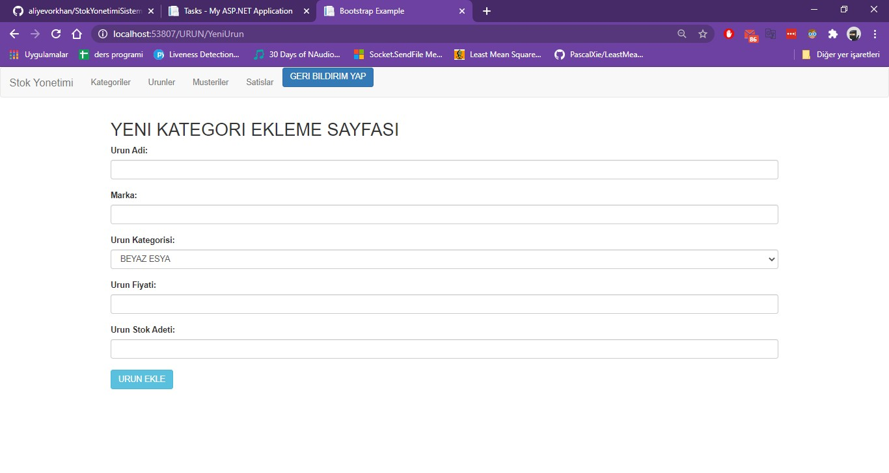

Ürün Güncelleme sayfası:

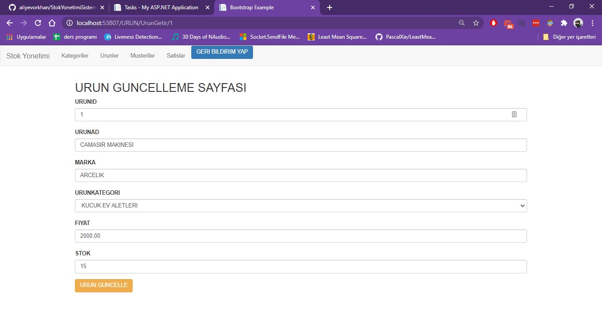

Müşteriler sayfası:

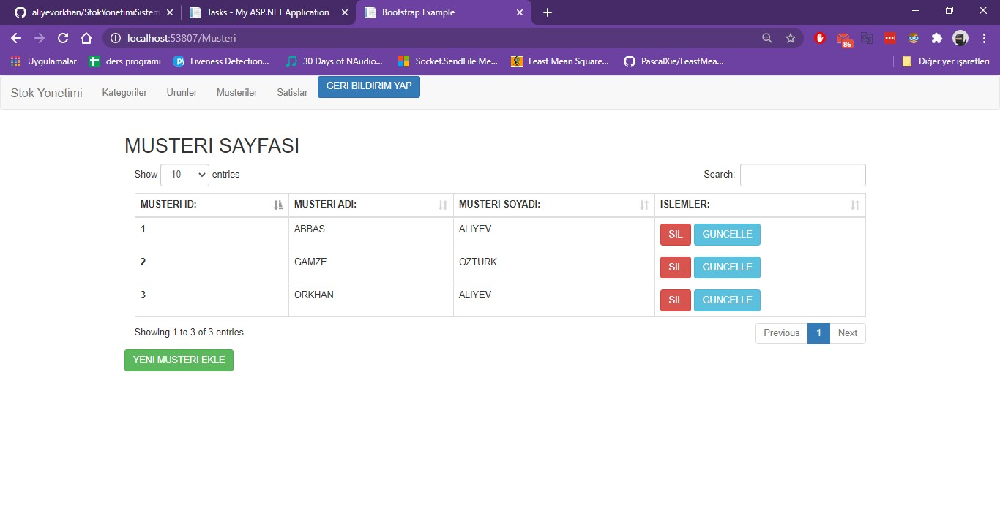

Yeni Müşteri Ekleme sayfası:

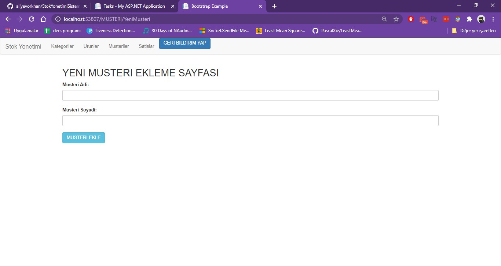

Müşteri Güncelleme sayfası:

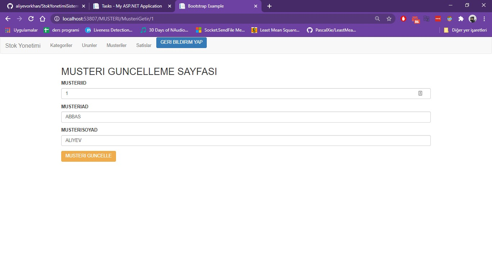

Satışlar sayfası:

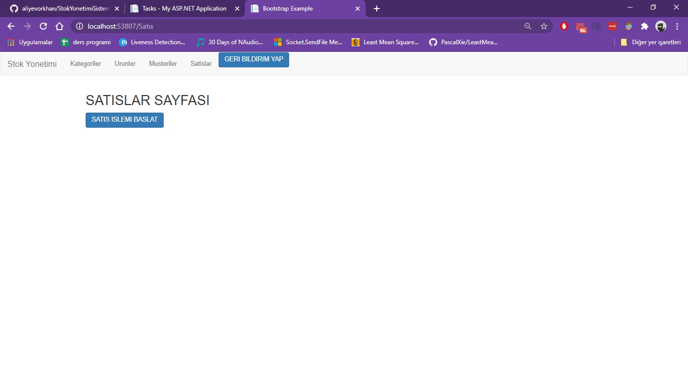

Satış Yapma ekranı:

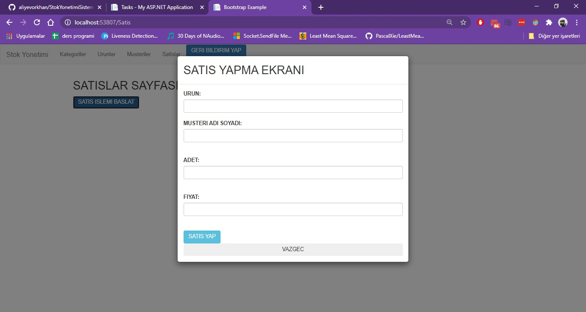

Geribildirim ekranı:

